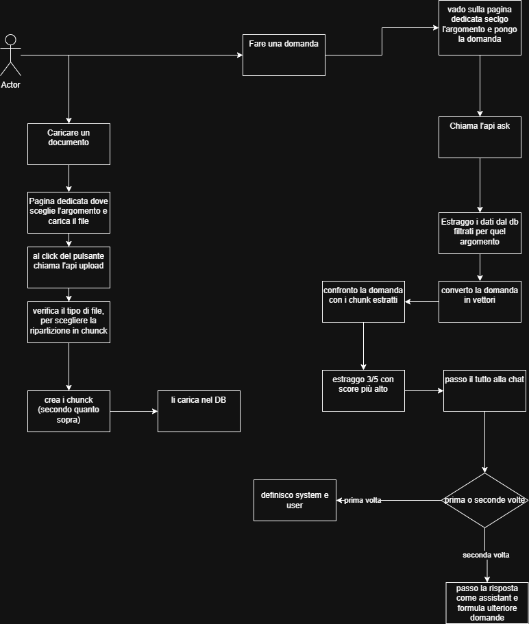

# Obiettivi

Obbiettivo del rag è quello di creare un sistema, che dato un documento di diversa natura, sia in grado di leggere estrarre il contenuto e convertirlo in vettori da confrontare.

## Cose da fare

### Task 1

Creare una parte Fe in Vue, che abbia:
- un form con i seguenti campi:
  - argomento/tag
  - input per caricare i file (text,CSV,excel,Word,PDF,markdown)
- creare una pagina dove possono essere consultati i file, vedere le loro divisioni(*chunk*) e vedere gli argomenti inseriti a sistema.
- una chat dove sarà possibile scegliere l'argomento e porre le domande relative a questo.

### Task 2

In python(o laravel) valutare come leggere ed estrarre il contenuto dei file e decidere se optare per le funzioni di *LangChain* di python per la ripartizione del file oppure se creare qualcosa custom

### Task 3

Creazione del sistema di rag:
- salvataggio dei vettori nel db
- lettura di quest'ultimi dalla db, filtrati per l'argomento
- confronto con la domanda
- chiamata della chat
- storicizzazione della domanda
- creazione delle api per il Fe

## Linguaggio

- python per la parte rag
- gestione accessi (auth) in laravel e chiamata dell'api esposta dal python
- Vue o react per la parte Fe legata a laravel( con inertia)

## Database

Per il database proverò ad usare o postgress o sqllite, per il salvataggio dei chunk.

## Note

Studiare un sistema di valutazione del risultato, magari creando un sistema predittivo con agenti ai.

Si può pensare a una tabella di test, dove il sistema interroga per n volte l'argomento x con la stessa domanda o con variazione di essa, per vedere se e come risponde.
Se in tutti i casi, il sistema risponde positivamente, allora la valutazione è alta; viceversa, il contrario.

Valutare se esistono ( in python) sistemi di valutazione delle rag.

## Logica 

## Fase di studio e confronto con ChatGPT

**Chunking non è solo “spezzare testo”**

 1. Fixed-size chunking
 > 500–800 token + overlap
 Usalo per:
 - testi grezzi
 - CSV
 - log

2. Structure-aware chunking (consigliato per te)

- PDF → per pagina + paragrafi
- Word → heading / sezioni
- Markdown → titoli

Questo è molto allineato al tuo diagramma

3. Semantic chunking (livello avanzato)

- spezza quando cambia l’argomento
- usa embeddings per chunkare

**Manca una cosa importante nel diagramma**

E' qui che il tuo progetto fa il salto di qualità.
Manca il concetto di:*decisione multi‑obiettivo*
Attualmente:
- scegli solo per similarità
Nel mondo reale devi considerare:
- similarità
- copertura
- ridondanza
- qualità del chunk

<pre>
final_score =
  0.6 * similarity +
  0.2 * chunk_quality +
  0.2 * novelty
</pre>

**System prompt (statico o versionato)**
<pre>
Sei un assistente che risponde SOLO usando i documenti forniti.
Se non trovi informazioni sufficienti, rispondi: "Non presente nei documenti".
</pre>

Un chunk È:

>“la più piccola unità di informazione che ha senso da sola per rispondere a una domanda”

**Strategie di chunking consolidate (industriali)**
1. Fixed-size chunking (baseline)
<pre>N caratteri / N token
overlap = X
</pre>
*da usare solo come fallback*

2. Recursive chunking (LangChain)
LangChain fa:
- prova a dividere per:
<pre>
\n\n
\n
.
</pre>
- se troppo grande → divide
- se troppo piccolo → unisce

- ✔️ molto meglio
- ✔️ buon compromesso
-  ❌ non conosce il dominio

-  👉 Ottima base iniziale

3. Semantic chunking (livello avanzato)
- usa embedding intermedi
- spezza quando il significato cambia
- esempio:
<pre>
fine di una definizione
cambio argomento
</pre>

- ✔️ qualità altissima
- ❌ più lento
- ❌ più complesso

- 👉 da fare dopo, non subito

 4. Structure-aware chunking (IL MIGLIORE)
Usi la struttura del documento:

- PDF:
 - pagine
 - titoli
- Word:
 - heading
 - paragrafi
- CSV:
 - righe
- Codice:
 - funzioni
 - classi

- ✔️ semanticamente naturale
- ✔️ molto robusto
- ✔️ spiegabile

- 👉 Questo è quello che stai già pensando senza saperlo

**Step 2 — Dimensione chunk**
- Regola pratica:
  - 500–800 token
  - overlap: 10–20%
- ⚠️ meglio:
  - 10 chunk medi
  - che 2 enormi

**Step 3 — Metadati OBBLIGATORI**
<pre>
{
  "topic": "argomento scelto",
  "source": "file.pdf",
  "page": 3,
  "chunk_index": 5,
  "strategy": "pdf_page_recursive",
  "version": "v1"
}
</pre>

